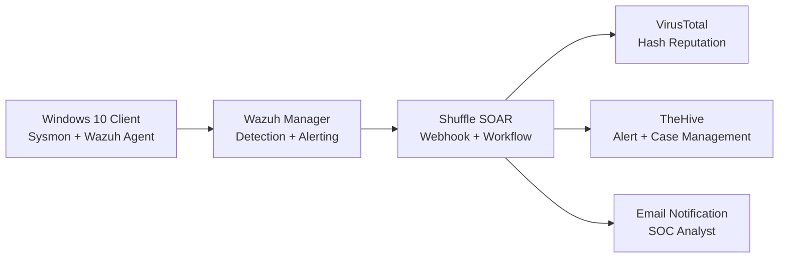

# Security Operations Automation & Detection Engineering

GitHub version of Security Operations Automation & Detection Engineering by Austin BC. This lab builds an automated Security Operations Center workflow using Wazuh, Sysmon, Shuffle, TheHive, and VirusTotal.

The project demonstrates how to generate endpoint telemetry from a Windows 10 client, ingest and alert on that telemetry in Wazuh, send selected alerts to Shuffle, enrich file hashes with VirusTotal, create alerts in TheHive, and notify a SOC analyst by email.

> Lab safety: Run this only in an isolated lab environment that you own and control. The Mimikatz activity in this guide is used as detection telemetry, not as an authorization to collect or misuse credentials.

## Architecture



## What This Builds

- Windows 10 lab endpoint with Sysmon telemetry.
- Wazuh server on Ubuntu 22.04.
- Wazuh Windows agent connected to the Wazuh manager.
- TheHive server with Cassandra and Elasticsearch dependencies.
- Custom Wazuh rule for Mimikatz detection using `originalFileName`.
- Wazuh-to-Shuffle webhook integration.
- Shuffle workflow that extracts a SHA256 hash, queries VirusTotal, creates a TheHive alert, and sends email.

## Repository Layout

| Path | Purpose |
|---|---|
| [`docs/lab-guide.md`](docs/lab-guide.md) | Full GitHub-ready lab guide rewritten from the PDF. |
| [`docs/security-notes.md`](docs/security-notes.md) | Safety, scope, and operational guardrails. |
| [`docs/troubleshooting.md`](docs/troubleshooting.md) | Common failure points and checks. |
| [`docs/image-gallery.md`](docs/image-gallery.md) | Extracted screenshots from the original PDF, embedded for GitHub viewing. |
| [`docs/image-manifest.md`](docs/image-manifest.md) | Page-to-image extraction manifest. |
| [`assets/images/`](assets/images/) | 97 extracted PDF images used by the docs. |
| [`tools/extract_pdf_assets.py`](tools/extract_pdf_assets.py) | Reusable helper for extracting text and images from the source PDF. |

## Quick Start

1. Read the safety scope in [`docs/security-notes.md`](docs/security-notes.md).
2. Follow the full implementation in [`docs/lab-guide.md`](docs/lab-guide.md).
3. Use [`docs/troubleshooting.md`](docs/troubleshooting.md) when Wazuh, TheHive, Shuffle, Filebeat, or firewall behavior does not match the expected result.
4. Refer to [`docs/image-gallery.md`](docs/image-gallery.md) for screenshots from the original PDF.

## Core Detection Logic

The lab's key detection idea is to avoid matching only the process name shown on disk. Instead, the custom Wazuh rule checks Sysmon's `originalFileName` field so the alert can still trigger when the executable is renamed.

```xml
<rule id="100002" level="15">
  <if_group>sysmon_event1</if_group>
  <field name="win.eventdata.originalFileName" type="pcre2">(?i)\\mimikatz\.exe</field>
  <description>Mimikatz Usage Detected</description>
  <mitre>
    <id>T1003</id>
  </mitre>
</rule>
```

## Workflow Summary

1. Generate Sysmon telemetry on the Windows 10 client.
2. Forward Sysmon events to Wazuh through the Wazuh agent.
3. Trigger the custom Wazuh rule for Mimikatz-like telemetry.
4. Send matching alert JSON to Shuffle through a webhook.
5. Extract the SHA256 hash from the alert payload.
6. Query VirusTotal for file reputation.
7. Create a TheHive alert.
8. Notify the SOC analyst by email.

## Notes

- Ubuntu 22.04 is used because the original lab notes dependency issues with later Ubuntu releases.
- Replace public IP addresses, webhook URLs, hostnames, passwords, API keys, and email addresses with your own lab values.
- Do not commit secrets such as TheHive API keys, Shuffle webhook URLs, or VirusTotal API keys.
