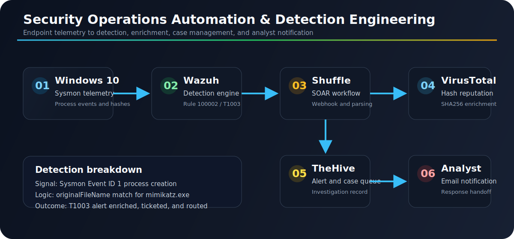

# Security Operations Automation & Detection Engineering

By Austin BC

This project is a full defensive security engineering lab that turns raw endpoint activity into an automated SOC response pipeline. It brings together endpoint telemetry, detection logic, alert routing, enrichment, case creation, and analyst notification into one cohesive workflow.

The lab focuses on a realistic blue-team scenario: detecting Mimikatz-like behavior from a Windows endpoint, forwarding the event through Wazuh, enriching the alert through Shuffle and VirusTotal, creating an investigation record in TheHive, and notifying a SOC analyst with the details needed to respond.

> Lab safety: Run this only in an isolated environment that you own and control. The Mimikatz activity in this project is used strictly as detection telemetry.

## Repository Layout

| Path | Purpose |
|---|---|
| [`docs/lab-guide.md`](docs/lab-guide.md) | Complete implementation guide. |
| [`docs/security-notes.md`](docs/security-notes.md) | Safety scope, secret handling, and exposure notes. |
| [`docs/troubleshooting.md`](docs/troubleshooting.md) | Common Wazuh, Shuffle, TheHive, and telemetry issues. |
| [`docs/image-gallery.md`](docs/image-gallery.md) | Full visual walkthrough with extracted screenshots. |
| [`docs/image-manifest.md`](docs/image-manifest.md) | Screenshot extraction manifest. |
| [`assets/images/`](assets/images/) | Extracted and redacted lab screenshots. |
| [`tools/extract_pdf_assets.py`](tools/extract_pdf_assets.py) | Helper script for extracting PDF text and images. |

## Topology



## What This Project Demonstrates

- End-to-end SOC automation using open-source security platforms.
- Windows endpoint telemetry collection with Sysmon.
- Centralized detection and alerting with Wazuh.
- Custom detection engineering mapped to MITRE ATT&CK `T1003`.
- Alert forwarding from Wazuh to Shuffle using webhook integration.
- SHA256 extraction from alert payloads for automated enrichment.
- VirusTotal reputation lookup inside a SOAR workflow.
- TheHive alert creation for case management and investigation tracking.
- Email notification for analyst handoff.

## Detection Objective

The core detection is intentionally built around `originalFileName` instead of only the process filename. That matters because an attacker can rename a binary on disk, but Sysmon can still preserve metadata that reveals what the file originally was.

```xml
<rule id="100002" level="15">
  <if_group>sysmon_event1</if_group>
  <field name="win.eventdata.originalFileName" type="pcre2">(?i)\\mimikatz\.exe</field>
  <description>Mimikatz Usage Detected</description>
  <mitre>
    <id>T1003</id>
  </mitre>
</rule>
```

## Automation Flow

1. Sysmon records detailed process telemetry on the Windows endpoint.
2. The Wazuh agent forwards Sysmon events to the Wazuh manager.
3. Wazuh applies a custom rule for Mimikatz-like credential-dumping behavior.
4. Wazuh sends matching alert JSON to Shuffle.
5. Shuffle extracts the SHA256 hash from the event payload.
6. VirusTotal enriches the hash with reputation data.
7. Shuffle creates a structured alert in TheHive.
8. The analyst receives an email notification with investigation context.

## Why It Matters

This lab shows how security operations can move beyond passive alert review. The pipeline captures activity, evaluates it with detection logic, enriches the signal, creates an investigation artifact, and routes context to an analyst. That is the practical foundation of modern detection engineering and SOC automation.

## Quick Start

1. Review [`docs/security-notes.md`](docs/security-notes.md).
2. Build the environment using [`docs/lab-guide.md`](docs/lab-guide.md).
3. Use [`docs/troubleshooting.md`](docs/troubleshooting.md) when service, telemetry, or workflow behavior does not match the expected result.
4. Browse [`docs/image-gallery.md`](docs/image-gallery.md) for the visual walkthrough.

## Notes

- Ubuntu 22.04 is used for the Wazuh and TheHive servers.
- Replace all placeholder IPs, webhook URLs, hostnames, passwords, API keys, and email addresses with your own lab values.
- Never commit live credentials, API keys, webhook URLs, or active infrastructure details.
